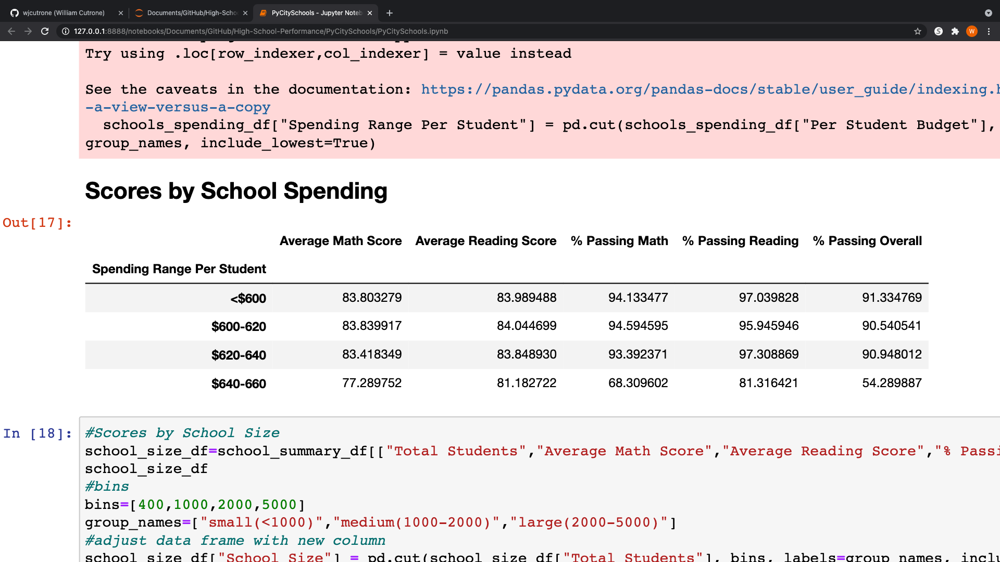
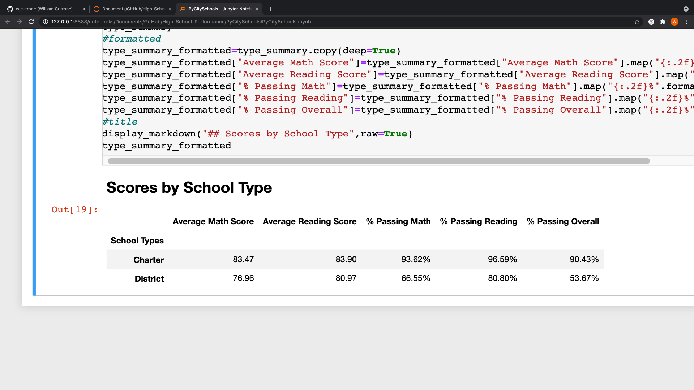
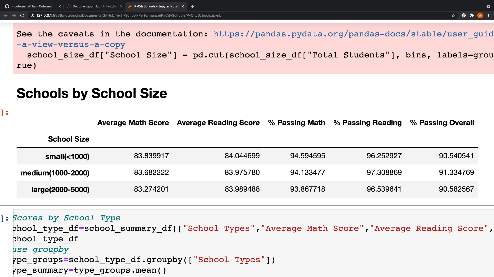

# High School Performance
The objective of this repository was to evaluate various characteristics of different high schools in a give district. The project started with two csvs, one containing all the different high schools, and the other containing information on each student and what high school that student attended. The two csvs were each converted into dataframes, and then joined into one larger dataframe by performing a join with Pandas, with the dataframes being joined on the high school column (since this column is present in both datasets).

After looking at the data, there were a couple of trends that really stood out to me. The first was from the table “Scores by School Spending”. I was both surprised and intrigued by this. Before doing the data analysis, I would have assumed that a school with a larger per student budget would end up having higher average test scores and a higher percentage of students who passed the exams. One would logically assume that such a school had better resources to offer their students. However, the exact opposite is actually true. The schools in the lowest spending brackets actually had the highest average math and reading scores, and highest percentage of passing students for math, reading, and overall passing(passing both). Conversely, the schools in the highest spending bracket actually have the worst averages and lowest percentage of passing in those same categories. I’m very curious as to know why this is. 

Another trend that I noticed was that charter Schools outrank district Schools in all academic performance categories. They have significantly higher average math and reading scores, and they have significantly higher percentages of students who pass math, reading, and both exams. In addition, all of the top five performing schools in the district are charter schools. And all five of the bottom performing schools in the district are the district schools. The most striking difference is that of overall passing. The percentage for charter Schools is about 90%, and the percentage for district schools is only 53%, which is  a massive difference. This tends to make sense though as charter schools are known to have more rigorous curriculums, smaller class sizes, increased independence with regards to design of curriculum, and more individualized support. Lastly, it makes sense that charter schools have higher scores and percentages of passing student because they are held to higher performance standards than district schools in order to justify their very existence. 

Lastly,  I initially expected that differences in school sizes would have a significant impact on performance. I initially thought that with a smaller school size, there is more possibility for students to receive attention and support from teachers. However, the data supports no such prediction. The small schools bracket and the large schools bracket have almost identical average scores in both math and reading, and almost identical percentages in those who passed math, reading, and both. Therefore, the data supports that school size really doesn’t seem to impact performance at all. I am also both very interested and surprised by this. 

